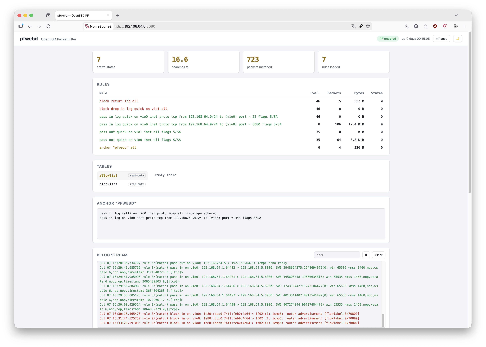

# pfwebd — An API, a read-only web interface, and a Terraform provider for managing OpenBSD PF firewalls

Pfwebd is a lightweight, **read-only** web interface to monitor a PF firewall on OpenBSD, paired with a **Terraform provider** to manage it as code. 

It's a single Go binary with no external dependencies, embedded frontend.

The web UI only *displays* the firewall (status, states, rules, counters, interfaces, table contents, live `pflog` streaming over SSE, and the `pfwebd` anchor ruleset). 

All rules update go through the API and are driven by the **Terraform provider** ([`terraform-provider-pfwebd/`](terraform-provider-pfwebd/docs/index.md)), which is the single writer. Writes use the backend's anti-lockout cycle (validate → apply → confirm or auto-rollback).

## Screenshot of web interface




## Quick start (development, no OpenBSD required)

Mock mode replays realistic `pfctl` output, no firewall needed:

Start the demo mode:
```sh
go run ./cmd/pfwebd -mock
# then open http://127.0.0.1:8080
```

Start the demo mode with rule update possibility:
```sh
PFWEBD_TOKEN=devtoken go run ./cmd/pfwebd -mock
# then open http://127.0.0.1:8080 and use Terraform to updates rules
```

## Quick start on OpenBSD

Prerequisite:

Your user should have doas permission on the server.

To do so, you can add this line to the file `/etc/doas.conf`:

```
permit persist your-user as root
```


Prepare the server:

```sh
doas pkg_add git go
git clone https://github.com/gduale/pfwebd.git
cd pfwebd
```

Install pfwebd:

```sh
doas files/deploy-pfwebd.sh
# or, with an initial write token for Terraform and a custom address:
doas files/deploy-pfwebd.sh -a 0.0.0.0:8080 -t
```
Note: you can replace `0.0.0.0` with your server IP to listen only on this specific IP.

The script `files/deploy-pfwebd.sh` builds the binary (if Go is present), creates the `_pfwebd` user, installs `pfwebd` and the `pfwebd-table` wrapper, appends the `doas.conf` entries, creates the state/config dirs and tokens file, installs the rc.d service, then enables and starts it. Re-run it anytime to update your configuration.


The script also checks `/etc/pf.conf` for the `anchor "pfwebd"` directive and the managed tables (`table <blocklist> persist`, `table <allowlist> persist`) and appends them if missing.

The daemon listens on `127.0.0.1:8080` by default; to reach it from the admin network, change `-addr` or (better) publish it over TLS with the native `relayd` or `httpd`.


## Architecture

```
cmd/pfwebd/          daemon entry point
internal/pfctl/      runner (doas pfctl/tcpdump, strict allowlist) + mock + parsers
internal/logs/       hub fanning the pflog stream out to SSE clients
internal/rules/      pfwebd anchor manager (apply -> confirm/rollback cycle)
internal/api/        REST + SSE endpoints
internal/web/        embedded frontend (vanilla JS, no build step)
files/               doas.conf, pf.conf (pfwebd anchor), pfwebd-table, rc.d script
terraform-provider-pfwebd/   Terraform provider (anchor_ruleset and table resources; docs/)
```

Security principles:

- The daemon runs as an **unprivileged user** (`_pfwebd`) and goes through `doas` to execute `pfctl`.
- **Strict allowlist**: only the exact invocations defined in `internal/pfctl/runner.go` (and permitted in `doas.conf`) can ever be executed. No shell.
- Table operations (the only dynamic arguments) go through the `files/pfwebd-table` wrapper, which **re-validates** operation, table name and address. The Go side also validates table names (strict regex) and addresses (`net/netip`). Defense in depth.
- Only tables listed in `-rw-tables` are writable (by a `write`-scoped token); everything else is read-only.
- Rule changes go **only to the `pfwebd` anchor**, never to `/etc/pf.conf`. Your base rules (SSH, UI access) stay untouchable.
- **Anti-lockout**: every ruleset is validated (`pfctl -n`), applied, then **rolled back automatically after `-confirm-timeout` (60 s by default) unless confirmed** — if a rule cuts the writer off, the previous state comes back on its own. The Terraform provider confirms after applying.
- Strict policy for anchor rules: `pass`/`block`/`match` only; the `anchor`, `include` and `load` keywords are rejected.
- Optional persistence (`-rules-file`): the confirmed ruleset is re-applied at startup (useful after a reboot, since the anchor starts empty).
- **API tokens** (Bearer authentication for tooling such as Terraform): tokens are stored **hashed** (SHA-256), never in clear text, and carry a **scope** (`read` or `write`). They live in a `-tokens-file` that is **reloaded on `SIGHUP`** (`rcctl reload pfwebd`) — so you can rotate or revoke a token without restarting. A single token can also be passed via the `PFWEBD_TOKEN` environment variable (implicit `write` scope). Generate one with `pfwebd -gen-token` — run under `doas` (so it can write the tokens file) and the line is appended for you; otherwise it is printed for you to add manually.
- **Always read-only**: the web UI is a pure dashboard — it can only *display* the configuration. Every non-GET request is rejected unless it carries a token with the `write` scope, so Terraform is the single writer. If no token is configured, all writes are disabled.

## Managing with Terraform

The [`terraform-provider-pfwebd`](terraform-provider-pfwebd/docs/index.md) provider drives the `pfwebd` anchor and the tables through the API, with the same anti-lockout cycle (the provider confirms after applying; if the rules cut its access, automatic rollback).

Full documentation: [provider](terraform-provider-pfwebd/docs/index.md), [pfwebd_anchor_ruleset](terraform-provider-pfwebd/docs/resources/anchor_ruleset.md), [pfwebd_table](terraform-provider-pfwebd/docs/resources/table.md), [pfwebd_status](terraform-provider-pfwebd/docs/data-sources/status.md), [complete example](terraform-provider-pfwebd/examples/main.tf).

## API

| Endpoint          | Description                              |
|-------------------|------------------------------------------|
| `GET /api/status`     | PF status, state table, counters (`pfctl -s info`) |
| `GET /api/states`     | parsed active states (`pfctl -s states`)  |
| `GET /api/rules`      | rules + statistics (`pfctl -s rules -v`) |
| `GET /api/interfaces` | raw output of `pfctl -s Interfaces -v` |
| `GET /api/tables`     | table list + `writable` flag    |
| `GET /api/tables/{name}` | addresses of one table (`pfctl -t X -T show`) |
| `POST /api/tables/{name}` | `{"action":"add\|delete","address":"IP or CIDR"}` (403 if the table is not listed in `-rw-tables`) |
| `GET /api/logs/stream` | SSE stream of pflog (`tcpdump -n -e -ttt -l -i pflog0`), 200-line backlog |
| `GET /api/anchor`     | `{"active":[…], "pending":{rules,deadline}\|null, "live":"…"}` — confirmed rules, pending change, and live anchor content read directly from PF |
| `POST /api/anchor`    | `{"rules":["block in quick from …", …]}`: validates, applies and arms the rollback (400 if invalid, 409 if a change is already pending) |
| `POST /api/anchor/confirm` | confirms the pending change (makes it permanent) |
| `POST /api/anchor/cancel`  | cancels the pending change (immediate rollback) |

All `GET` endpoints are read-only and need no token. Every `POST` requires an `Authorization: Bearer <token>` whose token carries the `write` scope, otherwise it is rejected (401 for an unknown token, 403 for a read-only one).
